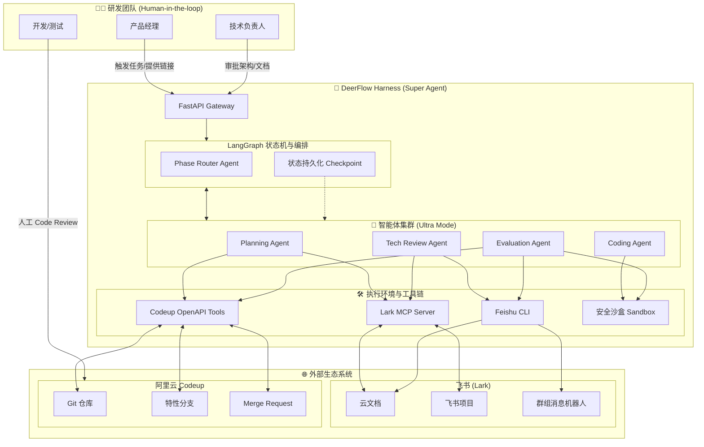
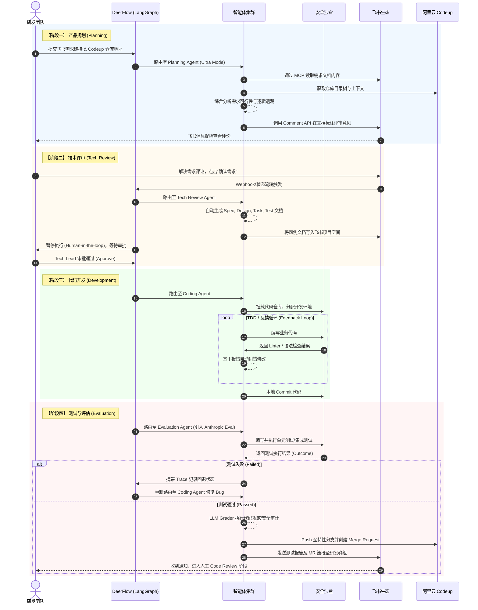

# DeerFlow 智能研发工作流 - 架构与流程图

本文档基于 `deer-flow` 的 LangGraph + Sandbox 底座，结合飞书与 Codeup 生态，梳理了完整的智能研发工作流架构图。

## 1. 整体系统架构图 (System Architecture)

---

## 2. 研发工作流时序图 (Workflow Sequence)

该时序图展示了从需求规划到代码合并的完整生命周期，强调了 Agent 的执行动作、自动化闭环以及“人在回路（Human-in-the-loop）”的关键节点。

## 3. 架构设计关键点说明

1. **状态机与断点恢复 (Checkpointing)**
   - 依赖 LangGraph 的 Durable Execution，每一步（例如：代码写到一半、等待人类审批）都会进行状态持久化。即使服务重启，系统依然能从数据库读取 Checkpoint 并恢复上下文，继续开发。
2. **多智能体协作 (Sub-agent Orchestration)**
   - **Phase Router Agent** 充当大脑，根据当前的 LangGraph 节点决定调用哪个专业 Agent。
   - **Coding Agent** 专注于在 Sandbox 中实现功能，具备持续的“执行-报错-修复”反馈循环（Harness 理念）。
   - **Evaluation Agent** 包含多个 Grader（例如代码逻辑的 LLM Grader，运行测试覆盖率的 Code-based Grader），充当独立的验收裁判。
3. **环境物理隔离**
   - 外部生态（飞书/Codeup）的交互严格依赖 MCP 和指定的 OpenAPI 工具封装。
   - 代码的编译、构建、测试全部在隔离的 Docker / Pydantic Sandbox 中运行，防止 Agent 的不安全命令破坏宿主环境。